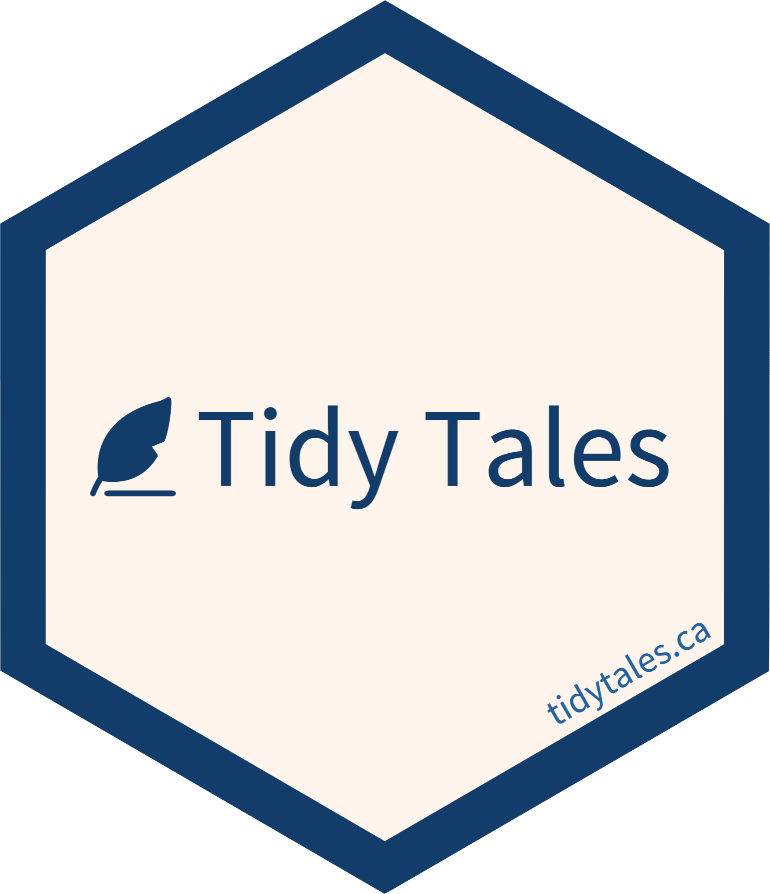

# Tidy Tales 

## About

[Tidy Tales](https://tidytales.ca) is a data science blog meant to demonstrate the skills needed in a typical data science project. Namely, wrangling, visualizing, modelling, and communicating data, all with the assistance of programming. The blog takes its name from the [tidy data](https://www.jstatsoft.org/article/view/v059i10) framework for structuring data, and from its narrative style. My inspiration for the blog came from [Tidy Tuesday](https://github.com/rfordatascience/tidytuesday), a weekly data project for practicing and building data science skills with real-world data. Many, but not all, of the posts on Tidy Tales will use data from Tidy Tuesday.

You can support Tidy Tales by sharing it with others or by making a [donation](https://www.paypal.com/donate?hosted_button_id=BT3A5MBCASKFQ). If you see mistakes or want to suggest changes, please [create an issue](https://github.com/mccarthy-m-g/tidytales/issues/new) in this repository.

<!--
## Useful links

<https://zbib.org>
-->
